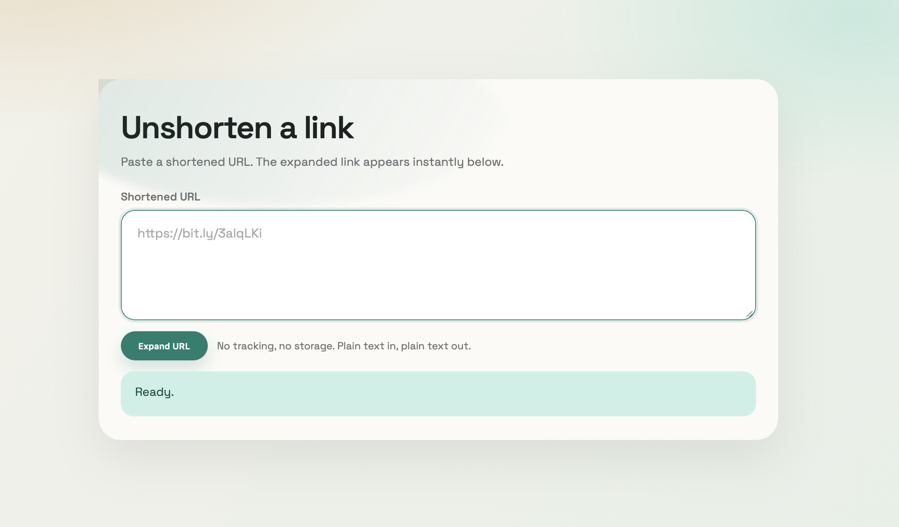

URLEXPAND (Node)
================
Node.js port of the Rust urlexpand crate. Expands shortened URLs, strips tracking parameters,
and includes a tiny web UI + redirect endpoint.



Why this exists
---------------
I built this tool because AdGuard blocks some shortened links (e.g., AliExpress).
This lets me unshorten and clean links without enabling those shortener domains,
and removes tracking parameters for a clean URL.

Requirements
------------
- Node.js 18+ (uses built-in `fetch`)
- Optional: set `URLEXPAND_INSECURE=1` to allow invalid TLS certs (matches Rust behavior).
  This sets `NODE_TLS_REJECT_UNAUTHORIZED=0` under the hood.
- Optional: set `URLEXPAND_DNS=google` (or a comma-separated list of DNS servers)
  to bypass local DNS overrides (e.g., `8.8.8.8,8.8.4.4`).

Library usage
-------------
```js
const { unshorten, isShortened } = require("./src/index");

const url = "https://bit.ly/3alqLKi";
if (isShortened(url)) {
  unshorten(url, 10000)
    .then((expanded) => console.log(expanded))
    .catch(console.error);
}
```

CLI usage
---------
```bash
node bin/unshorten.js https://bit.ly/3alqLKi
```

Web server
----------
```bash
node server.js
```
Then open `http://localhost:8080`. Set `URLEXPAND_PORT` or `PORT` to override the port.

Redirect endpoint
-----------------
Use a URL path like:
```
http://localhost:8080/https://s.click.aliexpress.com/...
```
The server expands + cleans and responds with a 302 redirect to the final URL.

Tracking cleanup
----------------
Expanded URLs are automatically stripped of common tracking parameters:
`utm_*`, `fbclid`, `gclid`, `aff_*`, `aff_trace_key`, `terminal_id`,
`afSmartRedirect`, `spm`, `scm`, `tt`, `sk`, and others.

Supported shorteners
--------------------
- `adf.ly` / `atominik.com` / `fumacrom.com` / `intamema.com` / `j.gs` / `q.gs`
- `adfoc.us`
- `amzn.to`
- `b.link`
- `bit.ly` / `j.mp` / `smq.tc`
- `bit.do`
- `bn.gy`
- `branch.io`
- `buff.ly`
- `cutt.ly` / `cutt.us`
- `db.tt`
- `f.ls`
- `fa.by` / `rebrand.ly`
- `fb.me`
- `flip.it`
- `geni.us`
- `git.io`
- `gns.io` / `ldn.im` / `tr.im`
- `goo.gl` (legacy)
- `hmm.rs`
- `ht.ly` / `ow.ly`
- `hyperurl.co`
- `is.gd`
- `kutt.it`
- `linklyhq.com`
- `lnkd.in`
- `microify.com`
- `mzl.la`
- `nmc.sg`
- `nowlinks.net`
- `plu.sh`
- `prf.hn`
- `qr.ae` / `qr.net`
- `rb.gy`
- `rlu.ru`
- `rotf.lol`
- `s.click.aliexpress.com`
- `s.coop`
- `s.id`
- `sh.st` / `ceesty.com`
- `soo.gd`
- `short.gy` / `shortcm.xyz`
- `shorturl.at`
- `smu.sg`
- `snip.ly` / `snipr.com` / `snipurl.com` / `snurl.com`
- `split.to` / `tny.sh`
- `surl.li`
- `t.co`
- `t.ly`
- `t2m.io`
- `tiny.cc` / `tiny.pl` / `tinyium.com` / `tinyurl.com` / `tiny.one` / `tny.im`
- `trib.al`
- `u.to`
- `v.gd`
- `virg.in`
- `vzturl.com`
- `waa.ai`
- `washex.am`
- `x.co` (legacy)
- `y2u.be`
- `yourwish.es`
- `zpr.io`

Convenience launcher
--------------------
```bash
./run.sh
```
This starts the server with `URLEXPAND_DNS=google` and `URLEXPAND_INSECURE=1` enabled.

Credits
-------
Original project: `urlexpand` by marirs (Rust).  
Repository: https://github.com/marirs/urlexpand
